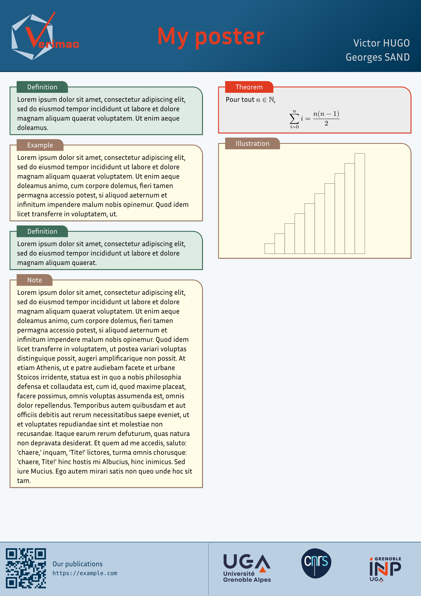

# Verimag poster template



## Getting started

This template uses [Typst](https://typst.app/), which is a tool similar to LaTeX,
but more user-friendly.

To compile the poster run the following commands:
```sh
$ typst watch --font-path=fonts/ --root=. src/poster.typ poster.pdf
```

Alternatively, the following shorthands are available:
```sh
$ make watch
$ just watch
```

See `Makefile` or `justfile` for more.

You can then configure all the options you want in `src/poster.typ`,
and include your own content.

## Structure

- `assets/`: logos, images, and other static resources;
- `fonts/`: font files used by the document;
- `src/`: source code, including
  - `poster.typ`: main entry point
  - `verimag.typ`: Verimag palette and style definitions
  - `elems.typ`: defines styled boxes and common poster elements

`src/palettes.typ` is auxiliary tool to view available color palettes.

## Contributing

If the version you have is out of date, you can obtain the latest version
through one of the following channels:
1. Download it from one of the public repositories,
  either [github:vanille-n/verimag-poster](https://github.com/Vanille-N/verimag-poster)
  or [gricad:verimag/mohytos/verimag-poster](https://gricad-gitlab.univ-grenoble-alpes.fr/verimag/mohytos/verimag-poster);
2. Use the online version on [typst.app](https://typst.app/project/rZQdVx5NTTeBiLuCcmBT8z);
3. Contact the original author [Neven Villani](mailto:neven.villani@crans.org).

The GitHub repository also accepts feature requests and contributions.

